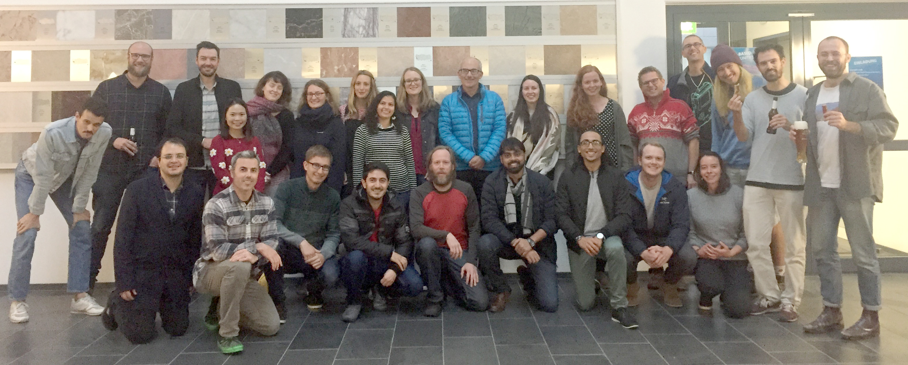

# 
From point clouds and full-waveform data to DEM analysis (Sep-30 to Oct-4 2019) 

#### 
Point-cloud workshop at the University of Potsdam

Support from
- [StRATEGy](http://www.irtg-strategy.de/index/) graduate school
- [University of Potsdam](https://up-rs-esp.github.io/)
- the [US-National Science Foundation EarthCube RCN "Connecting the Earth Science and Cyberinfrastructure communities to advance the analysis of high resolution topography data"](https://www.nsf.gov/awardsearch/showAward?AWD_ID=1642611&HistoricalAwards=false)
- [OpenTopography](https://opentopography.org/)
- [UP Transfer](https://www.up-transfer.de/)

## Description
In the past few years, the density and quality of point cloud data from lidar and photogrammetry has massively increased. This has enabled important new understanding in earth surface process science, but also has challenged our analytical tools and computational workflows. The generation of high resolution Digital Elevation Models, flow routing on point clouds, and surface roughness estimation has become more accessible and provides important measures of topography at the fine scale at which the processes operate. This workshop presents approaches to analyzing point cloud data and producing useful derived products. It also explores future applications in earth surface processes.

The workshop will progress from point cloud analysis to appropriate filtering and gridding and then geomorphic analysis on grids and point clouds. In addition, we will spend one day on explorations of full waveform analyses for a variety of applications as these data are progressively becoming more available and useful for bathymetric, vegetation, surface roughness measurements, and material property mapping.

This course is intended for graduate students and researchers with interests in surface processes and with experience in programming (Python and Matlab).

[Workshop Flyer](https://github.com/UP-RS-ESP/PointCloudWorkshop-Oct2019/raw/master/flyer_2019_webpage.pdf)

Group photo: thanks to all participants!!!! (photo by V. Torres-Acosta)

## Organization Committee and Instructors
[Bodo Bookhagen](https://bodobookhagen.github.io/), [Ramon Arrowsmith](https://www.public.asu.edu/~arrows/), [Chris Crosby](https://connect.unavco.org/display/per508132), [Taylor Smith](tasmith@uni-potsdam.de), [Fiona Clubb](https://fclubb.github.io/), [Aljoscha Rheinwalt](https://github.com/Rheinwalt)

## Website and Documents
We will use this github website to share code and manuals and will continue to update and fill in (also during the workshop).
A list of relevant [documents and PDFs](https://github.com/UP-RS-ESP/PointCloudWorkshop-Oct2019/tree/master/PDF) are available.

[Required and suggested software](https://github.com/UP-RS-ESP/PointCloudWorkshop-Oct2019/blob/master/PDF/PC_Required_Software_Workshop.pdf)

## Participation will be by application (we are limited to 20 participants)
Workshop fees are 100 Euro. This includes snacks, coffee, beverages, lunch, and one workshop dinner on Monday. Thanks to support from the NSF EarthCube A^2HRT RCN, we will provide travel support for up to five early career participants from the US.

You can apply for the workshop [online](http://tiny.cc/ivg89y) and the application deadline is *August 23, 2019*. **We will inform selected participants and expect payment of the workshop fees until *Sept 6, 2019*. If no payment is received by then, we will offer the slot to another candidate.**

## Accomodation and Hotels
The workshop venue is the [Campus Golm](https://www.google.com/search?tbm=lcl&ei=wI85XYfFE4rRwAKr2DE&q=Karl-Liebknecht-Stra%C3%9Fe+24-25%2C+14476+Potsdam&oq=Karl-Liebknecht-Stra%C3%9Fe+24-25%2C+14476+Potsdam&gs_l=psy-ab.3..38l3.131238.133490.0.134023.2.2.0.0.0.0.87.166.2.2.0....0...1c.1.64.psy-ab..0.1.86....0.n0oBY4Efq_Q#rlfi=hd:;si:11329416506967667491;mv:!1m2!1d52.40871997731902!2d12.974945031694851!2m2!1d52.40836002268096!2d12.974354968305148!3m12!1m3!1d339.6918546312415!2d12.974649999999999!3d52.408539999999995!2m3!1f0!2f0!3f0!3m2!1i1865!2i1715!4f13.1) at the [University of Potsdam](https://www.uni-potsdam.de/en/index.html). See also the more detailed [campus plan](https://www.uni-potsdam.de/db/zeik-portal/gm/lageplan-up.php?komplex=2).

There is a list of hotels and accomodation in [Potsdam](https://github.com/UP-RS-ESP/PointCloudWorkshop-Oct2019/tree/master/PDF/Potsdam_Hostels_2018.pdf) and [Berlin](https://github.com/UP-RS-ESP/PointCloudWorkshop-Oct2019/tree/master/PDF/Berlin_Hostels_2018.pdf). Public transport in Potsdam takes ~10 to 15 minutes to the Campus Golm, commuting via bike is also possible. Public transport takes you from Berlin downtown to the campus in 30 minutes.

# Tentative Program
*If you are using your own laptop, please make sure to install the software packages listed in the [PDF](https://github.com/UP-RS-ESP/PointCloudWorkshop-Oct2019/raw/master/doc/PC_Required_Software_Workshop.pdf)*

**Monday, Sept 30, 2019 start 9am**
- Introduction to Point Clouds (Bodo)
  - Introduction to PC, classification, Transformation matrices, KDTress [PDF of presentation](https://github.com/UP-RS-ESP/PointCloudWorkshop-Oct2019/raw/master/PDF/Lidar_PC_WorkshopOct2019_Intro.pdf)
  - Desktop based (Python driven) computational workflows (I) (Bodo + Aljoscha)
    - CloudCompare and aligning different point cloud datasets
    - Importing LAZ/LAS files into python: airborne lidar to photogrammetric SFM warping example [Doming slides and example PDF](https://github.com/UP-RS-ESP/PointCloudWorkshop-Oct2019/raw/master/PDF/20190930a_SfM_Doming_example.pdf), [Doming slides and example PPT with video](https://github.com/UP-RS-ESP/PointCloudWorkshop-Oct2019/raw/master/PDF/20190930a_SfM_Doming_example.pptx), [CloudCompare and Python PDF manual](https://github.com/UP-RS-ESP/PointCloudWorkshop-Oct2019/raw/master/doc/PC_alignment_c2cdistances.pdf), [python code](https://github.com/UP-RS-ESP/PointCloudWorkshop-Oct2019/raw/master/Python-codes/remove-spherical-error.py)

- [OpenTopography](https://opentopography.org/) introduction and production implementations (Ramon and Chris)
  - [A few science motivators and lidar + SfM overview](https://github.com/UP-RS-ESP/PointCloudWorkshop-Oct2019/raw/master/PDF/20190930_motivations_and_applications.pdf)
  - [OpenTopography intro + review of basic processing workflows](https://cloud.sdsc.edu:443/v1/AUTH_opentopography/www/shortcourses%2F19Potsdam%2F19Potsdam_OTintro.pdf)
  - DEM processing for flow routing using TauDEM HPC

4 - 5pm   *Evening student presentations*

**Tuesday, October 1, 2019**
- [OpenTopography continued - hydraulogic routing, change detection, Community Dataspace; Other data sources: UNAVCO TLS, NEON, OpenAltimetry](https://cloud.sdsc.edu/v1/AUTH_opentopography/www/shortcourses%2F19Potsdam%2F19Potsdam_OTintro.pdf)
- Desktop based (Python driven) computational workflows (II) (Aljoscha + Bodo)
  - Point cloud classification and filtering and voxel-based approached ([Python code voxel-classification-lidar.py](https://github.com/UP-RS-ESP/PointCloudWorkshop-Oct2019/raw/master/Python-codes/voxel-classification-lidar.py) and [Python code voxel-classification-lidar.py](https://github.com/UP-RS-ESP/PointCloudWorkshop-Oct2019/raw/master/Python-codes/voxel-classification-zstd.py)) [PDF manual](https://github.com/UP-RS-ESP/PointCloudWorkshop-Oct2019/raw/master/doc/Classification_and_filtering_PC.pdf), [Etherpad Link](https://yourpart.eu/p/r.fff525596f57aff85f0295b5cc3e16d2)
  - interpolation to grids using the most appropriate methods (from triangulation to IDW and fitting green's functions and splines and other surfaces) [github: Lidar_PC_interpolation](https://github.com/BodoBookhagen/Lidar_PC_interpolation)
  - Efficient computation with point clouds using python, cython, and KDTrees (Example for generating DEMs from dense pointclouds) [github: LidarPC-KDTree](https://github.com/UP-RS-ESP/LidarPC-KDTree), [Etherpad KDTree](https://yourpart.eu/p/r.abf455105f3996ac0769c82ef95417d5), [Python code Volumetric_Density_PC_KDTree](https://github.com/UP-RS-ESP/PointCloudWorkshop-Oct2019/raw/master/Python-codes/Volumetric_Density_PC_KDTree.py), [Python code plot_density_from_hdf](https://github.com/UP-RS-ESP/PointCloudWorkshop-Oct2019/raw/master/Python-codes/plot_density_from_hdf.py)
  - Other topics depending on time and participant's interests

4 - 5 pm *Evening student presentations*

**Wednesday, October 2, 2019**
- Desktop based (Python driven) computational workflows (III) (Taylor + Aljoscha + Bodo)
  - Determining optimal DEM resolutions from point clouds [PDF manual](https://github.com/UP-RS-ESP/PointCloudWorkshop-Oct2019/raw/master/PDF/Optimal%20DEM%20Resolution%20Manual.pdf), [python code](https://github.com/UP-RS-ESP/PointCloudWorkshop-Oct2019/raw/master/Python-codes/figs_pc_workshop.py), [publication](https://github.com/UP-RS-ESP/PointCloudWorkshop-Oct2019/raw/master/PDF/smith19_optimal_grid_resolution.pdf)

**Thursday, October 3, 2019**
- Topographic analysis with [LSD TopoTools](https://lsdtopotools.github.io/) (Fiona)
  - Introduction to LSDTT [LSDTopoTools presentation](https://github.com/UP-RS-ESP/PointCloudWorkshop-Oct2019/raw/master/PDF/LSDTopoTools_presentation.pdf), [LSDTT PDF manual](https://github.com/UP-RS-ESP/PointCloudWorkshop-Oct2019/raw/master/PDF/LSDTT_workshop.pdf), [Etherpad link](https://yourpart.eu/p/r.b240d942ccb3bf06612c6522c31282ae)
  - Flow routing on point clouds using TINs [publication](https://github.com/UP-RS-ESP/PointCloudWorkshop-Oct2019/raw/master/PDF/Rheinwalt19_FFN_pointclouds.pdf)
  - River-profile clustering [RiverProfile Clustering presentation](https://github.com/UP-RS-ESP/PointCloudWorkshop-Oct2019/raw/master/PDF/FClubb_Riverprofile_clustering_lr.pdf), [github repository and Jupyter notebook and tutorial](https://github.com/UP-RS-ESP/river-clusters), [publication](https://github.com/UP-RS-ESP/PointCloudWorkshop-Oct2019/raw/master/PDF/Clubb19_clustering_river_profiles.pdf)
  - Ridge-top curvature

**Friday, October 4, 2019**
- Full waveform lidar explanation and exploration with specific applications for geomorphology [PDF of introduction presentation](https://github.com/UP-RS-ESP/PointCloudWorkshop-Oct2019/raw/master/PDF/FWF_Lidar_Intro.pdf) (Bodo + Aljoscha)
   - FWF data examples are in [Golm-FWF](https://github.com/UP-RS-ESP/PointCloudWorkshop-Oct2019/tree/master/examples/Golm-FWF) and [fwf-lidar-displaz-examples](https://github.com/UP-RS-ESP/PointCloudWorkshop-Oct2019/tree/master/examples/fwf-lidar-displaz-examples)
   - FWF processing workflow describing separate steps, including LAZ/WDP-to-ASCII conversion, interactive beam visualization of points and corresponding FWF data, spline smoothing and interpolation, peak finding and generation of denser point cloud, Gaussian fitting to signals and extraction of amplitude and width of fitted signal, and some comments on PulseWave files [PDF document with links to source codes and description](https://github.com/UP-RS-ESP/PointCloudWorkshop-Oct2019/tree/master/PDF/PC_workshop_fwf_processing_Golm.pdf), [Etherpad Link](https://yourpart.eu/p/r.052bd8016d26784717d6d4ec879803c1)

***Evening student*** **presentations**
We will have short presentations by participants on Monday and Tuesday early evenings. You are STRONGLY encouraged to make one of these short (<5 minutes/<5 slides) presentations. We will have a computer and projector there and will collect the presentations in advance for quick transitions. Given the big group, we will be strict on timing, but we do look forward to hearing about your work, your ideas, or even questions. This will be very informal!
