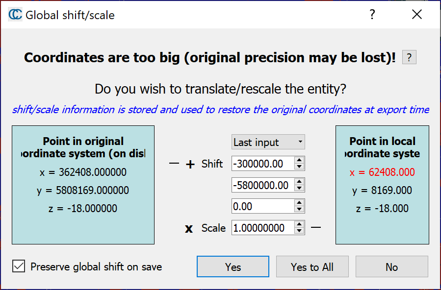
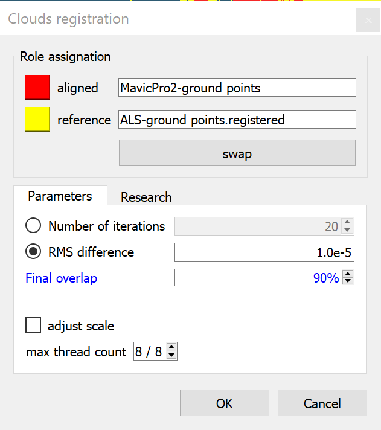
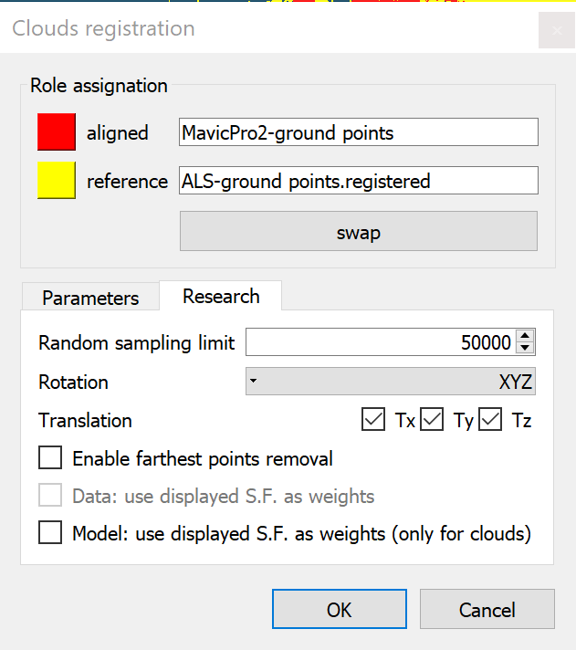
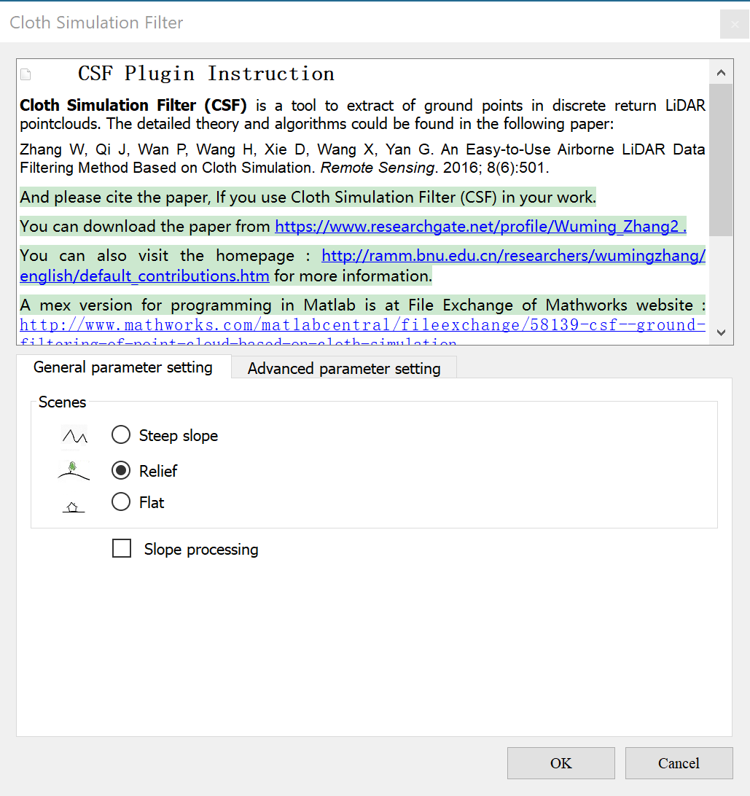

---
title: "Aligning ALS (Milan, May-06-2018) and UAV (Mavic Pro 2, Aug 2019) data using a spherical fit"
author: B. Bookhagen and A. Rheinwalt
date: 28-09-2019
header-includes: |
    \usepackage{caption}
...

We will use a precise airborne lidar dataset (ALS) with a high point density as reference dataset. We will align a UAV (Mavic Pro 2, nadir and 15-degree oblique imagery, processing with Agisoft Metashape/PhotoScan). You will note a doming effect of the UAV dataset - we will explore these further by fitting a sphere.

Alignment and Visualization is done in CloudCompare (can be done in PDAL or python as well)

1. *Load in data*. First load in ALS (reference PC) first. THEN load in second point cloud (Mavic Pro 2), make sure you use the same reference frame (last input and not suggested).

\begin{figure}[!h]
\caption{Make sure to select 'last input' when loading the second point cloud.}
\end{figure}
\hfill

2. *ICP Alignment*: Select two point clouds to be aligned, then select Tools->Registration->Fine Registration (ICP).
  - Set overlap to 90% (or something similar) before running the ICP step (unless you can be certain that the extent is exactly the same). No need for changing parameters on the research tab.
  - Make sure to store resulting transformation matrix (select in console and copy) - it will be useful to save this.
  - Verify that point clouds are aligned.

{width=50%}
{width=50%}
\begin{figure}[!h]
\caption{ICP Alignment}
\end{figure}
\hfill

3. *Calculate Cloud-to-Cloud Distance*: Select two point clouds, Tools->Distances->Cloud/Cloud Distance. Make sure to split into X, Y, Z direction

{width=50%}
{width=50%}
\begin{figure}[!h]
\caption{Cloud2Cloud Distance Computation Parameters}
\end{figure}
\hfill

4. *Ground-Point Cloud Classification* (optional but useful): Using Plugin Cloth Simulation Filter (CSF) and perform Cloth Simulation Filter Classification with resolution r=1 using Plugins->CSF Filter (Will not work well for UAV dataset).
  - Classify both datasets (1. ALS dataset and 2. registered, c2c dataset)
  - Are there problems with the classification? Is bare earth/ground properly detected?

{width=50%}
{width=50%}
\begin{figure}[!h]
\caption{Cloth Simulation Filter (CSF) Classification}
\end{figure}
\hfill

5. Save UAV ground and off-ground points, make sure to save additional fields. This will store a UAV (Mavic Pro 2) LAZ file with ground points and X, Y, Z, and total distance. *Note: Some OS/installations have problems reading LAZ files, it may be useful to store as LAS file (without compression), if you have trouble).*

  - Additionally, the classified ALS dataset can be stored.
